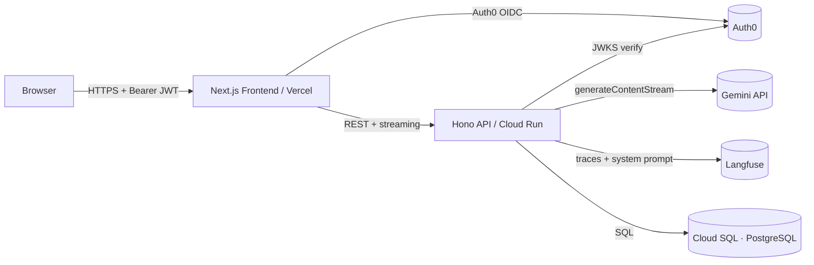

<div align="center">

# 🐾 Lynx

### *What can I help you ship?*

[**🚀 Try the Live Demo**](https://lynx-mu-eight.vercel.app)

An AI chat application built for engineers — fast, streaming, and persistent.
Think Claude.ai, with a dark terminal aesthetic.

[](https://www.typescriptlang.org/)
[](https://nextjs.org/)
[](https://vercel.com/)
[](https://hono.dev/)
[](https://www.postgresql.org/)
[](https://cloud.google.com/)

</div>

---

## Overview

Lynx is a full-stack, streaming AI chat application. A Next.js frontend talks to a
Hono API that streams responses from Google's Gemini models, verifies users with
Auth0, and persists every conversation to PostgreSQL. The backend is containerized
and runs on Google Cloud Run.

The design: managed Postgres, a modular monolith,
and complexity deferred until a measurement demands it.

## Features

- 💬 **Real-time streaming** — token-by-token responses over a chunked HTTP stream
- 🔐 **Authentication** — Auth0 (OIDC), JWT verified against JWKS on every request
- 🧠 **Markdown + math rendering** — GFM, syntax-highlighted code blocks, and KaTeX
- 💾 **Durable persistence** — conversations and messages stored in PostgreSQL
- 🏷️ **Auto-generated titles** — first exchange names the conversation
- 📊 **LLM observability** — request tracing and hosted prompt management via Langfuse
- ☁️ **Cloud-native** — containerized backend on Cloud Run, secrets in Secret Manager

## Architecture



**Durability ordering:** the user message is committed *before* the model is called,
and the assistant row is created *before* streaming begins — nothing acknowledged to
the client ever lives only in memory.

## Tech Stack

| Layer | Technology |
|---|---|
| **Frontend** | Next.js 16 (App Router), React 19, TypeScript, Tailwind CSS v4, shadcn/ui |
| **Backend** | Node.js, TypeScript, Hono 4 |
| **Database** | PostgreSQL (Cloud SQL), `pg`, ULID message IDs |
| **LLM** | Google Gemini (`@google/genai`) |
| **Auth** | Auth0 (`@auth0/nextjs-auth0`, `jose`) |
| **Observability** | Langfuse |
| **Infra** | Google Cloud Run, Artifact Registry, Secret Manager, Docker |

## Project Structure

```
.
├── backend/                 # Hono API + AI layer
│   ├── src/
│   │   ├── index.ts         # App + route definitions
│   │   ├── middleware/       # Auth0 JWT verification
│   │   ├── ai/              # Gemini chat, title generation, prompt cache
│   │   └── db/              # Connection pool + data access (users, conversations, messages)
│   ├── migration/           # SQL migrations
│   └── Dockerfile           # Multi-stage build for Cloud Run
└── lynx/                    # Next.js frontend
    └── src/
        ├── app/             # Routes, layout, auth token endpoint
        ├── components/ui/   # Chat app, sidebar, message thread, input
        └── lib/             # Auth0 client + utilities
```

## Getting Started

### Prerequisites

- Node.js 20+
- A PostgreSQL database
- Accounts/keys for: Google Gemini API, Auth0, and (optional) Langfuse

### 1. Backend

```bash
cd backend
npm install
cp .env.example .env   # then fill in the values below
npm run dev            # starts on http://localhost:8080
```

`backend/.env`:

```env
GEMINI_API_KEY=your-gemini-api-key

# Optional — observability + hosted prompt management
LANGFUSE_SECRET_KEY=your-langfuse-secret-key
LANGFUSE_PUBLIC_KEY=your-langfuse-public-key
LANGFUSE_BASE_URL=https://cloud.langfuse.com

# Database
DB_HOST=127.0.0.1
DB_PORT=5432
DB_NAME=lynx
DB_USER=postgres
DB_PASSWORD=your-db-password

# Auth0
AUTH0_DOMAIN=your-tenant.us.auth0.com
AUTH0_AUDIENCE=https://api.your-domain.example
```

### 2. Frontend

```bash
cd lynx
npm install
cp .env.example .env.local         # then fill in the values below
npm run dev                        # starts on http://localhost:3000
```

`lynx/.env.local`:

```env
AUTH0_DOMAIN=your-tenant.us.auth0.com
AUTH0_CLIENT_ID=your-client-id
AUTH0_CLIENT_SECRET=your-client-secret
AUTH0_SECRET=a-32-byte-random-string
AUTH0_AUDIENCE=https://api.your-domain.example
APP_BASE_URL=http://localhost:3000

# Point at the backend (defaults to localhost if unset)
NEXT_PUBLIC_API_URL=http://localhost:8080
```

Open [http://localhost:3000](http://localhost:3000) and sign in.

## API

All `/v1/*` routes require a valid `Authorization: Bearer <token>`.

| Method | Path | Description |
|---|---|---|
| `GET` | `/healthz` | Health check (unauthenticated) |
| `GET` | `/v1/conversations` | List the user's conversations |
| `POST` | `/v1/conversations` | Create a new conversation |
| `GET` | `/v1/conversations/:id/messages` | Load messages (cursor-paginated: `?limit=50&before=<message_id>`) |
| `POST` | `/v1/conversations/:id/messages` | Send a message, stream the reply |

Paginated reads return a `{ data, next_cursor, has_more }` envelope. Without a
cursor the most recent page is returned; pass `next_cursor` back as `before` to
load the next older page.

## Deployment

The backend ships as a container to **Google Cloud Run**:

```bash
cd backend
docker build --platform linux/amd64 -t <region>-docker.pkg.dev/<project>/<repo>/backend:latest .
docker push <region>-docker.pkg.dev/<project>/<repo>/backend:latest
gcloud run deploy lynx-backend --image=<...> --region=<region> --allow-unauthenticated
```

Secrets are injected at runtime from **Secret Manager**; the Cloud SQL connection
uses the built-in connector. No credentials are baked into the image.

The frontend is deployed to **Vercel**:
- Connect the GitHub repository to a new Vercel project.
- Set the Root Directory to `lynx`.
- Inject the Auth0 and Backend API URLs as Vercel Environment Variables.

## Security

- Secrets live in `.env` / `.env.local` (git-ignored) locally, and in Secret Manager
  in production. No credentials are committed to this repository.
- Every hot-path query is scoped by `user_id` or `conversation_id` — no query scans
  across users.

## License

See [LICENSE](LICENSE).
